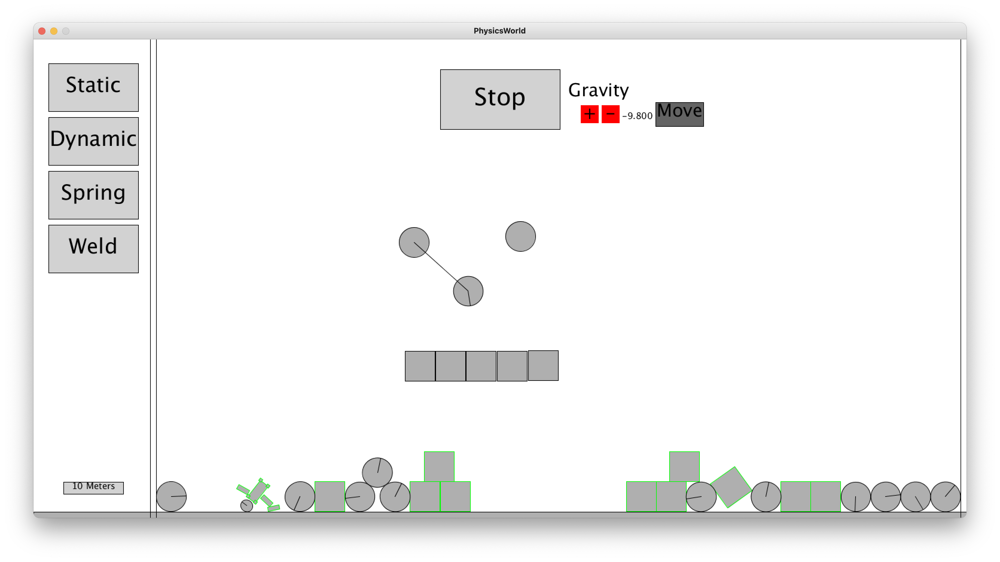

#  Simple Physics Simulator using Box2D and Box2DProcessing
Simple physics simulator created to learn the basics of a physics engine. A user can create circle and rectangles that are either static or dynamic bodies and joints between bodies using either weld or distance joints. They can also move previously placed bodies and toggle the physics on or off.

